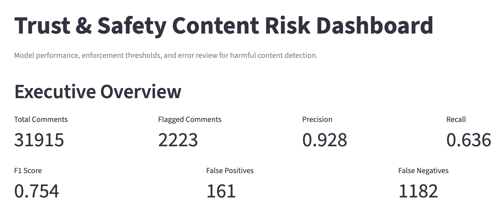
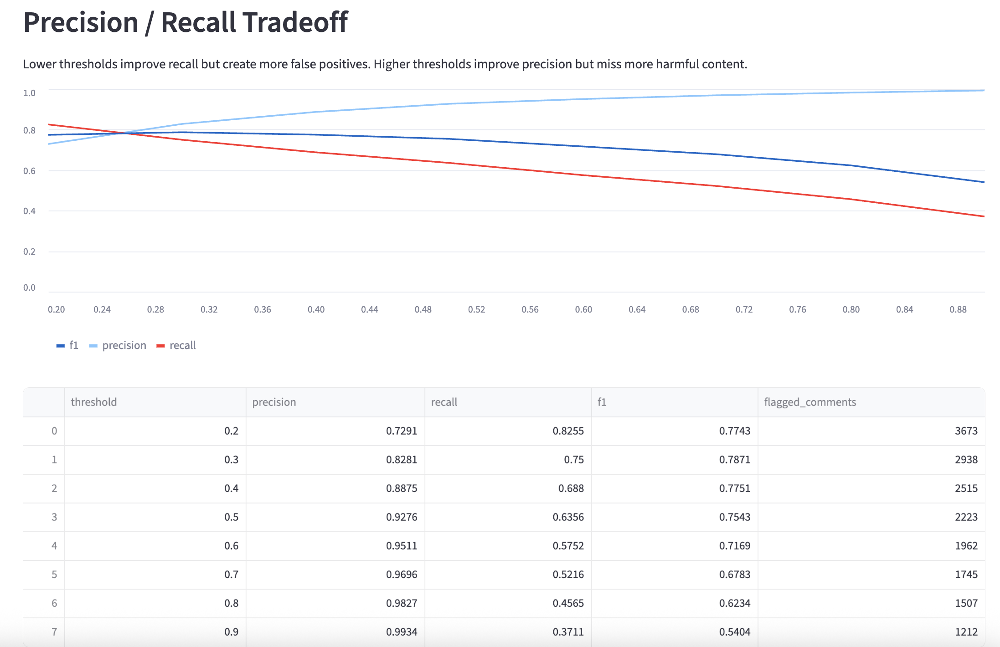
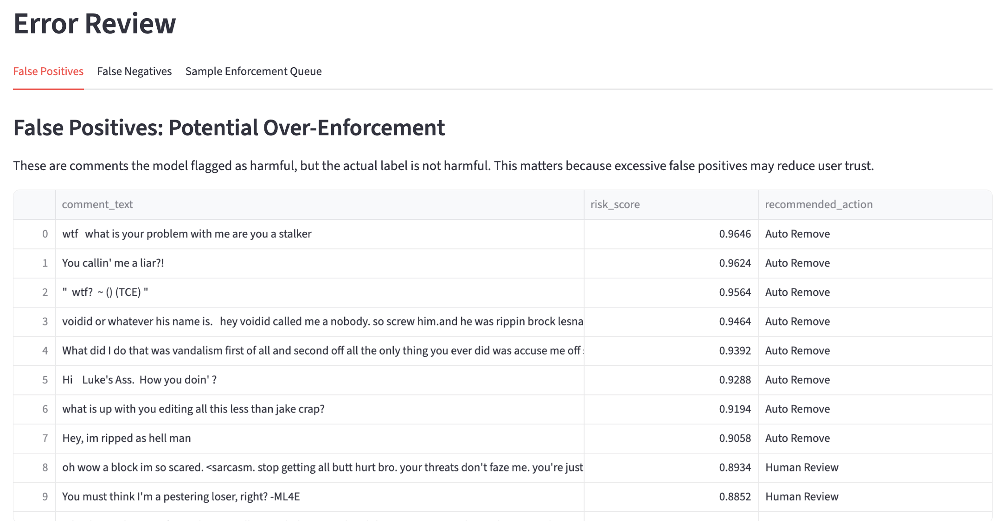

# Trust & Safety Content Risk Detection System

## Live Demo
https://trust-safety-risk-detection.streamlit.app

## Overview
This project simulates a Trust & Safety system for detecting harmful online content and supporting enforcement decisions.

Unlike standard NLP classification projects, this system focuses on:
- Precision vs Recall tradeoffs
- False positive / false negative risk analysis
- Threshold-based enforcement policies
- Decision support for content moderation

The goal is to model how real-world platforms (e.g., social media, search engines) balance safety, accuracy, and user experience.

---

## Dataset
- Jigsaw Toxic Comment Classification (Kaggle)
- ~160k comments labeled across multiple abuse categories:
  - toxic
  - severe_toxic
  - obscene
  - threat
  - insult
  - identity_hate

A binary label (`is_harmful`) was constructed to simulate real-world moderation decisions.

---

## Methodology

### 1. Data Processing
- Text cleaning and preprocessing
- Feature engineering using TF-IDF
- Binary classification target (`is_harmful`)

### 2. Model
- Logistic Regression classifier
- TF-IDF vectorization (10k features)

### 3. Evaluation Metrics
- Precision
- Recall
- F1-score
- False Positives / False Negatives

---

## Model Performance

| Metric | Value |
|------|------|
| Precision | 0.93 |
| Recall | 0.64 |
| F1 Score | 0.75 |

### Key Insight
- High precision → low over-enforcement risk
- Moderate recall → significant harmful content may be missed

---

## Threshold Analysis

| Threshold | Precision | Recall |
|----------|----------|--------|
| 0.2 | 0.73 | 0.83 |
| 0.5 | 0.93 | 0.64 |
| 0.9 | 0.99 | 0.37 |

### Tradeoff
- Lower thresholds improve recall but increase false positives
- Higher thresholds improve precision but miss harmful content

---

## Enforcement Policy

| Risk Score | Action |
|-----------|--------|
| >= 0.90 | Auto Remove |
| 0.50–0.90 | Human Review |
| 0.20–0.50 | Monitor |
| < 0.20 | Allow |

This reflects how real Trust & Safety systems combine automated detection with human moderation.

---

## Error Analysis

- False Positives: 161  
- False Negatives: 1182  

### Insight
- False negatives pose greater safety risk (harmful content remains visible)
- False positives impact user trust (over-removal)

---

## Dashboard

### Overview

### Threshold Tradeoff

### Error Review

The dashboard supports:
- Threshold tuning
- Precision / Recall monitoring
- Enforcement queue analysis
- Error inspection

---

## Business Recommendation

- Use high thresholds (>= 0.9) for automatic removal to ensure high precision
- Route mid-range scores (0.5–0.9) to human review
- Monitor lower-risk cases to improve recall
- For high-severity categories (e.g., threats), prioritize recall over precision

This system should be used as a **decision-support tool**, not a fully automated enforcement system.

---

## Tech Stack
- Python
- Pandas
- Scikit-learn
- Streamlit
- Plotly

---

## Project Structure